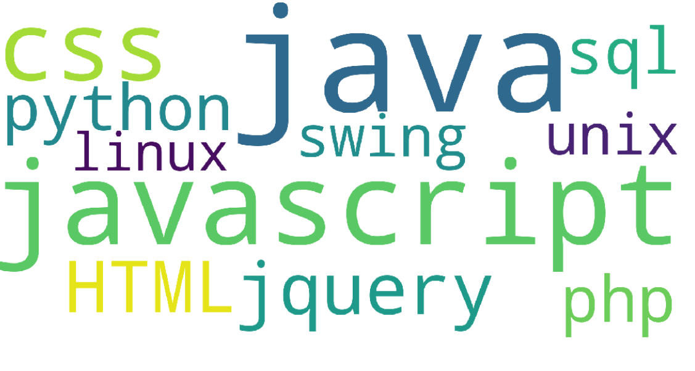

# Word-Cloud-Generator

This was our Advance Data Structures lab project. The case study we took up was to visually represent skillset requirements of today's companies for their recruitment process. The key challenge faced by the engineering education today is the need to constantly adapt to the changing requirements of industry. This Word cloud visual identifies the expectation and need of the industry.

A little preview of the final product

This was a java + python based model to hash maximum skillset of a student to create every individual’s “Skill Word Cloud”. The text with the largest font in the word cloud is the skill that is most looked for and vice versa. 

In order to run the project you have to install Jupyter Notebook
The java file runs to accept user inputs which is hashed in a hash map. The skillset with maximum collisions is the most appearing one. This can now be imported in the ipynb and the word cloud is generated.

Data structure used: Hash map
  Also uses File handling 
            Word cloud Visualization library in python
